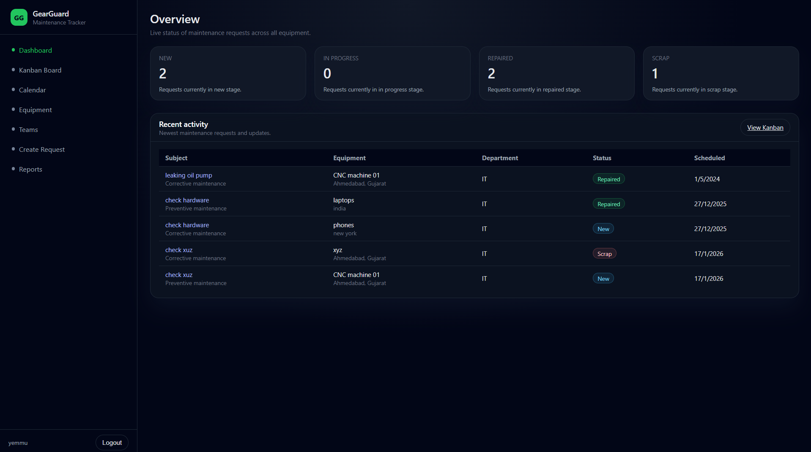
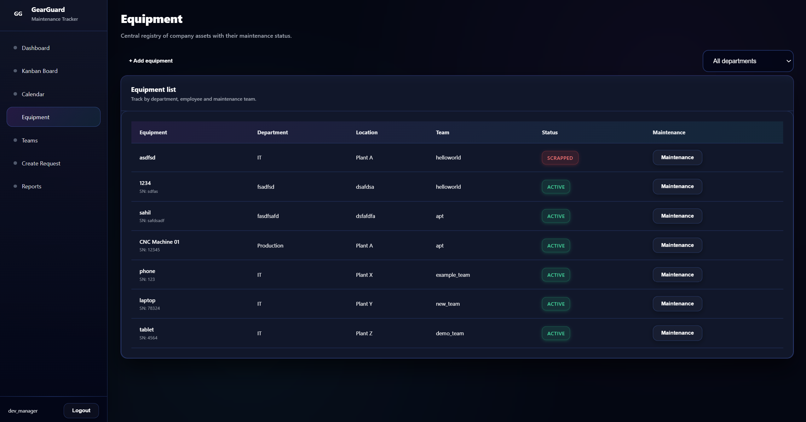
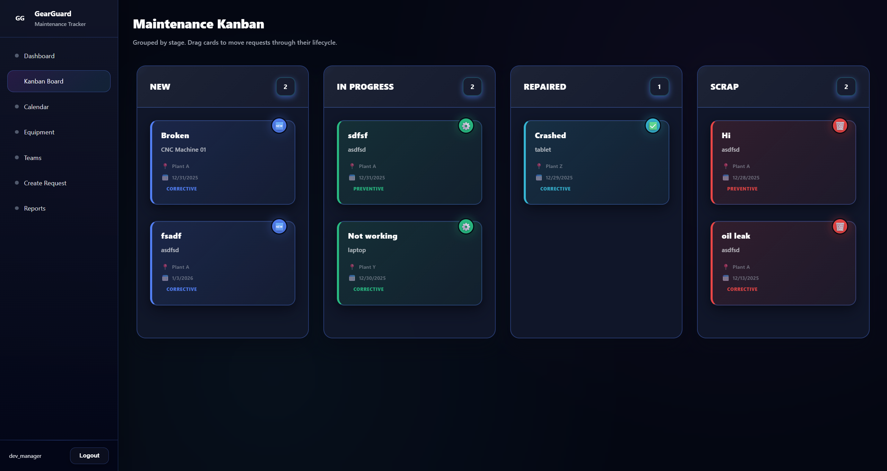
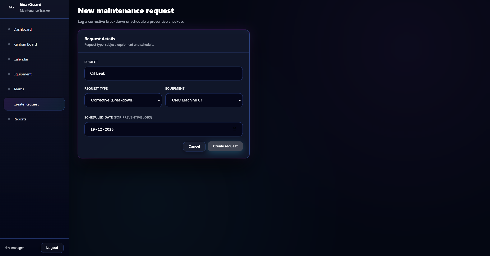
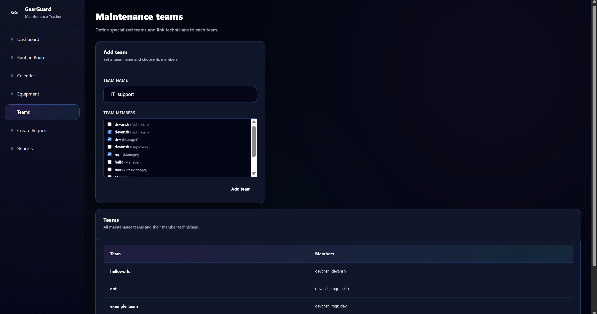
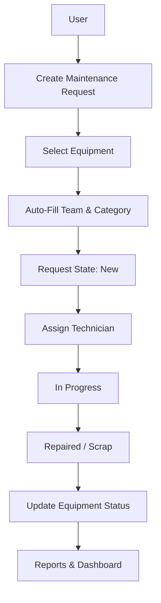

<!-- PROJECT TITLE -->
<h1 align="center">🛠️ GearGuard: The Ultimate Maintenance Tracker</h1>
<h2> <a herf="https://www.youtube.com/playlist?list=PLn6mEx9B-YCUJdnqeF4xzQh7oQF0eqI5z">Demo Link</a> </h2>

  
  
  
  

⚙️ <b>Asset breakdowns cause delays, losses, and chaos.</b> 
<b>GearGuard</b> solves this by providing a <b>smart, Odoo-like maintenance management system</b> that connects
<b>Equipment, Maintenance Teams, and Requests</b> in one seamless workflow.

---

## 📖 Table of Contents

- 🚩 [Problem Statement](#-problem-statement)
- 🎯 [Module Overview](#-module-overview)
- ✨ [Key Features](#-key-features)
- 🧠 [System Architecture](#-system-architecture)
- 📊 [Screenshots & Mockups](#-screenshots--mockups)
- 🛠️ [Tech Stack](#-tech-stack)
- ⚡ [Installation & Setup](#-installation--setup)
- 🖥️ [Usage & Workflow](#-usage--workflow)
- 🚀 [Future Enhancements](#-future-enhancements)
- 🤝 [Contributing](#-contributing)
- 👨‍💻 [Team Members](#-team-members)

---

## 🚩 Problem Statement

Organizations manage hundreds of assets like machines, vehicles, and IT equipment.  
When an asset breaks down:

- Requests are scattered  
- Ownership is unclear  
- Teams are misaligned  
- Preventive maintenance is often ignored  

This leads to **downtime, inefficiency, and increased costs**.

**GearGuard** addresses this by building a **centralized maintenance tracking system** with intelligent workflows, automation, and visual management.

---

## 🎯 Module Overview

**Objective:**  
Develop a maintenance management system that allows companies to:

- Track all assets (equipment)
- Assign responsibility to maintenance teams
- Manage corrective & preventive maintenance requests efficiently

**Core Philosophy:**  
> Seamlessly connect **Equipment (what is broken)**, **Teams (who fix it)**, and **Requests (the work to be done)**.

---

## ✨ Key Features

### 🏗️ Equipment Management
- Central database of all company assets
- Track equipment:
  - By **Department**
  - By **Employee**
- Dedicated maintenance team & default technician per equipment
- Key fields:
  - Equipment Name & Serial Number
  - Purchase Date & Warranty
  - Physical Location

### 👥 Maintenance Teams
- Create multiple specialized teams:
  - Mechanics
  - Electricians
  - IT Support
- Assign technicians to teams
- Only relevant team members can pick assigned requests

### 🧾 Maintenance Requests
- **Corrective Requests** – Unplanned breakdowns
- **Preventive Requests** – Scheduled routine maintenance
- Key fields:
  - Subject (issue description)
  - Equipment
  - Scheduled Date
  - Duration (hours spent)

---

## 🛠️ Tech Stack

### Frontend
- React.js
- Kanban & Calendar UI
- Charts & visual indicators

### Backend
- Node.js
- Express.js

### Database
- MongoDB

### Other Tools
- REST APIs
- Nodemon (for development)

---

## 🧠 System Architecture

<h2>⚡ Installation & Setup</h2>

# 1️⃣ Clone the repo

git clone https://github.com/Sahilchandel06/odoo-hackathon 

# 2️⃣ Install backend dependencies

cd backend 
npm install

# 3️⃣ Start the backend server

nodemon server.js

# 4️⃣ Start the frontend

cd frontend 
npm install 
npm run dev

---

## 🖥️ Usage & Workflow

### 🔴 Flow 1: Breakdown (Corrective Maintenance)

- Any user creates a maintenance request
- Selecting equipment auto-fills:
  - Equipment category
  - Assigned maintenance team
- Request starts in **New**
- Technician assigns themselves
- Status moves to **In Progress**
- Technician records duration
- Status moves to **Repaired**

---

### 🔵 Flow 2: Routine Checkup (Preventive Maintenance)

- Manager creates a preventive maintenance request
- Sets a scheduled date
- Request appears in **Calendar View**
- Technician performs maintenance on the scheduled date

<h2>👨‍💻 Team Members</h2>

Sahil Chandel (Team Lead) 
Devansh Deshpande 

